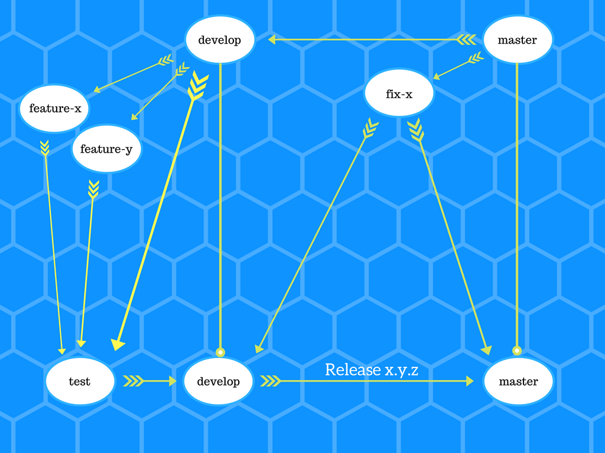

Git Workflow
============

Atualmente seguimos um fluxo para trabalhar com o versionamento chamado de Git Workflow. Costumizamos esse processo para se adapte de acordo com nossa realidade.

@todo: Adicionar imagem que foi criada sobre o fluxo aqui.

Inline-style: 

